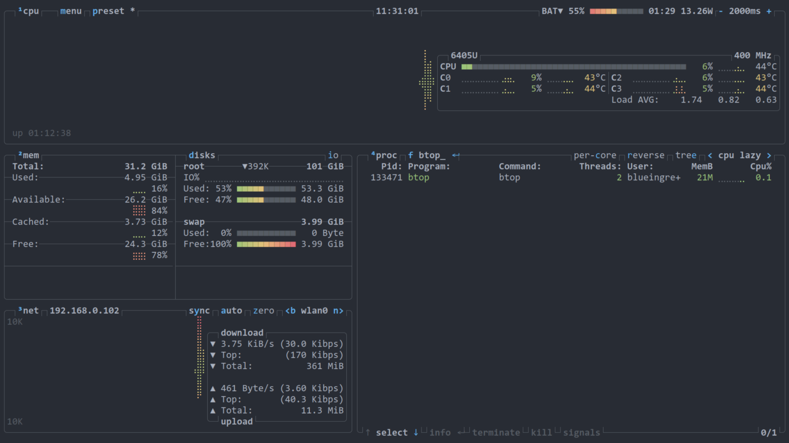
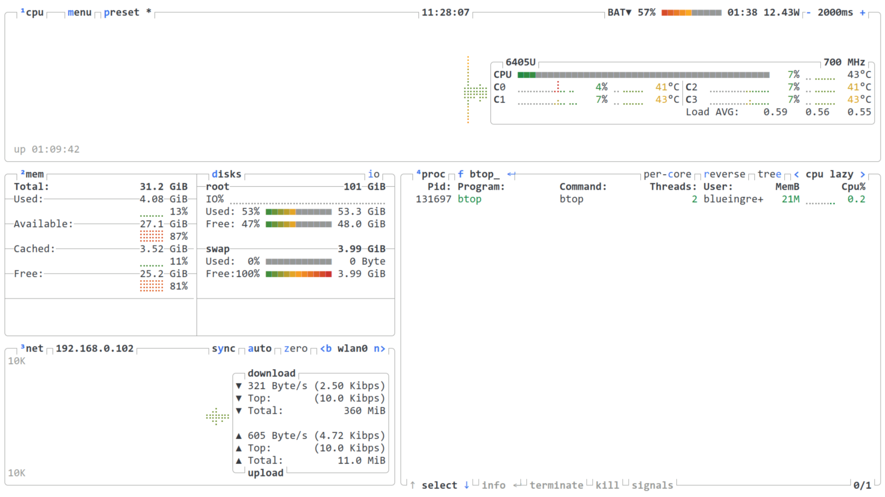
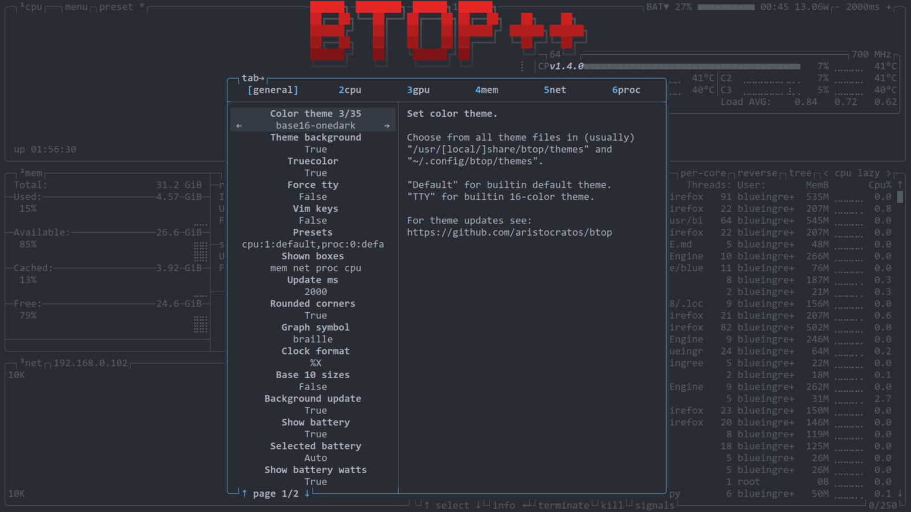

# base16-btop

<!-- markdownlint-disable MD013 -->

This repo provides templates for using [Base16](https://github.com/tinted-theming/home) color schemes with [btop](https://github.com/aristocratos/btop), a monitor of resources.

All files in `colors` directory generated by [lustache](https://luarocks.org/modules/olivine-labs/lustache) and [lustache-cli](https://github.com/djmattyg007/lustache-cli).

## Examples

### base16-onedark



### base16-google-light



## Usage

You can find an example config in `examples/base16-onedark.theme`.

> User created [themes](https://github.com/aristocratos/btop?tab=readme-ov-file#themes) should be placed in `$XDG_CONFIG_HOME/btop/themes` or `$HOME/.config/btop/themes`.

Add in [btop.conf](https://github.com/aristocratos/btop?tab=readme-ov-file#configurability) path to file `base16-onedark.theme`:

```conf
color_theme = "/path/to/.config/btop/themes/base16-onedark.theme"
```

or select theme in `btop`:



## License

MIT
